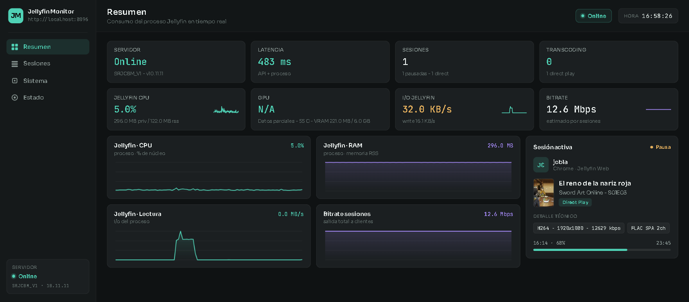
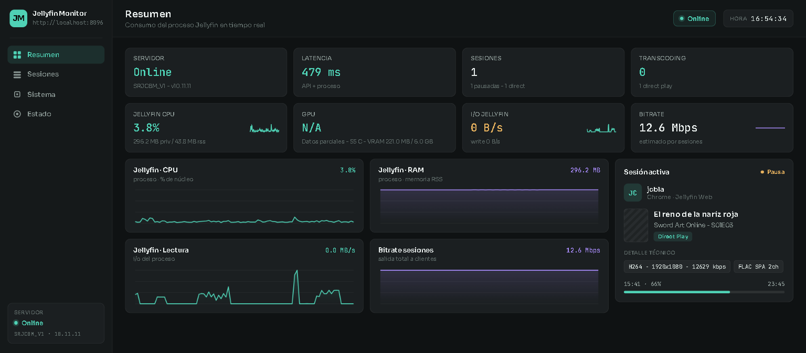
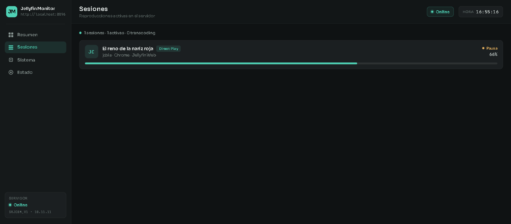
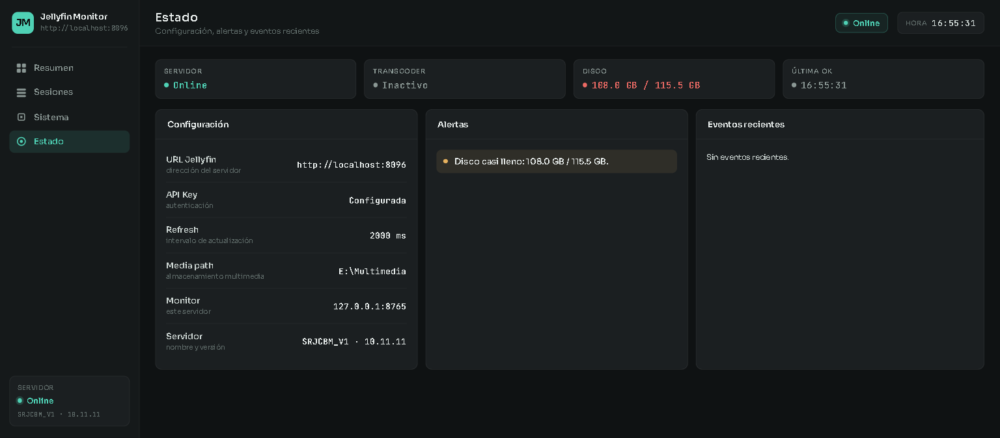

# Jellyfin Monitor

Dashboard web local para monitorear un servidor [Jellyfin](https://jellyfin.org/) en tiempo real.

El foco principal del panel es mostrar **qué está consumiendo Jellyfin**, separando las métricas del proceso `jellyfin.exe` de las métricas globales del equipo. El backend está escrito en Python y el frontend usa HTML, CSS y JavaScript vanilla, sin build tools ni frameworks.



## Características

- Sesiones activas con artwork del contenido, progreso, cliente, dispositivo y usuario.
- Detección de Direct Play y Transcoding, incluyendo codec, bitrate y razón de transcodificación.
- Métricas del proceso Jellyfin: CPU, RAM privada/RSS, lectura/escritura de disco, PID, uptime, threads y handles.
- Bitrate estimado de sesiones activas.
- Métricas globales del host en una vista separada: CPU, RAM, swap, disco, red y GPU.
- Soporte opcional para GPU NVIDIA mediante NVML: uso, VRAM, temperatura, power, encoder/decoder si están disponibles.
- Artwork protegido por proxy local: el navegador nunca recibe la API key de Jellyfin.
- Interfaz en español con tema oscuro grafito y acentos teal/menta.
- Documentación de API en [docs/api.md](docs/api.md).
- Tests con `pytest`.

## Capturas

| Resumen | Sesión con artwork | Sesiones | Estado |
|---|---|---|---|
|  |  |  |  |

## Requisitos

- Python 3.10 o superior.
- Servidor Jellyfin accesible desde la máquina donde corre el monitor.
- API key de Jellyfin.
- Opcional: GPU NVIDIA + `pynvml` para métricas de GPU.

## Instalación

```powershell
git clone https://github.com/SrJCBM/metricas-jellyfin.git
cd metricas-jellyfin

python -m venv .venv
.\.venv\Scripts\Activate.ps1

pip install -r requirements.txt
Copy-Item .env.example .env
notepad .env
```

Edita `.env` y coloca tu API key.

## Configuración

Ejemplo de `.env`:

```env
JELLYFIN_URL=http://localhost:8096
JELLYFIN_API_KEY=TU_API_KEY_AQUI
JELLYFIN_REFRESH_MS=2000
JELLYFIN_MEDIA_PATH=E:\Multimedia
JELLYFIN_MONITOR_HOST=127.0.0.1
JELLYFIN_MONITOR_PORT=8765
JELLYFIN_MONITOR_OPEN_BROWSER=1
```

Variables disponibles:

| Variable | Default | Descripción |
|---|---:|---|
| `JELLYFIN_URL` | `http://localhost:8096` | URL del servidor Jellyfin, sin barra final. |
| `JELLYFIN_API_KEY` | vacío | API key de Jellyfin. Requerida para sesiones e imágenes. |
| `JELLYFIN_REFRESH_MS` | `2000` | Intervalo de actualización del dashboard en milisegundos. |
| `JELLYFIN_MEDIA_PATH` | `E:\Multimedia` | Ruta de medios usada para métricas de disco del host. |
| `JELLYFIN_MONITOR_HOST` | `127.0.0.1` | Host donde escucha el monitor. Mantener local por seguridad. |
| `JELLYFIN_MONITOR_PORT` | `8765` | Puerto del dashboard. |
| `JELLYFIN_MONITOR_OPEN_BROWSER` | `1` | Abre el navegador al iniciar (`1` sí, `0` no). |

## Uso

```powershell
python .\jellyfin_monitor.py
```

El monitor queda disponible en:

```text
http://127.0.0.1:8765
```

Al iniciar verás un check de configuración parecido a:

```text
=== Jellyfin Monitor ===
[OK]   URL del servidor:  http://localhost:8096
[OK]   API Key:           Configurada
[OK]   Ruta multimedia:   E:\Multimedia
[INFO] Refresco:          2000 ms

Servidor listo en http://127.0.0.1:8765
```

## Vistas

- **Resumen**: estado del servidor, latencia, sesiones, transcoding, CPU/RAM/I/O de Jellyfin, GPU y bitrate.
- **Sesiones**: listado de sesiones activas con artwork, progreso y detalles técnicos.
- **Sistema**: métricas del host y del proceso Jellyfin para comparación.
- **Estado**: configuración, alertas y eventos recientes.

## API local

El backend expone endpoints HTTP locales:

| Endpoint | Descripción |
|---|---|
| `GET /api/metrics` | Devuelve todas las métricas usadas por el frontend. |
| `GET /api/image/{itemId}` | Devuelve artwork de Jellyfin mediante proxy local. |

La referencia completa está en [docs/api.md](docs/api.md).

## Seguridad

- La API key se lee desde `.env` y permanece en el backend.
- El frontend usa `/api/image/{itemId}` para cargar artwork sin exponer la API key.
- El monitor escucha en `127.0.0.1` por defecto.
- Si configuras `JELLYFIN_MONITOR_HOST` con una IP de red o `0.0.0.0`, el arranque muestra una advertencia porque el monitor no implementa autenticación.
- Las respuestas incluyen headers básicos de seguridad: `X-Content-Type-Options`, `X-Frame-Options` y `Referrer-Policy`.

## Tests

```powershell
python -m pytest
python -m py_compile .\jellyfin_monitor.py
```

## Estructura

```text
jellyfin_monitor.py      Backend HTTP + recolección de métricas
web/
  index.html             Estructura de la interfaz
  styles.css             Tema visual
  app.js                 Polling, renderizado y gráficos canvas
docs/
  api.md                 Documentación de endpoints
tests/
  conftest.py
  test_alerts.py
  test_formatting.py
  test_session.py
.env.example             Plantilla de configuración
requirements.txt         Dependencias Python
```

## Notas

- `Claude design/`, `.claude/`, `.playwright-mcp/` y exports de sesiones son archivos de trabajo local y no forman parte de la app.
- Las métricas de I/O del Resumen corresponden al proceso Jellyfin. Las métricas globales del equipo están en la vista Sistema.
- En Windows, algunas métricas de GPU como fan, encoder o decoder pueden aparecer como `N/A` aunque GPU, VRAM, temperatura y power funcionen.
